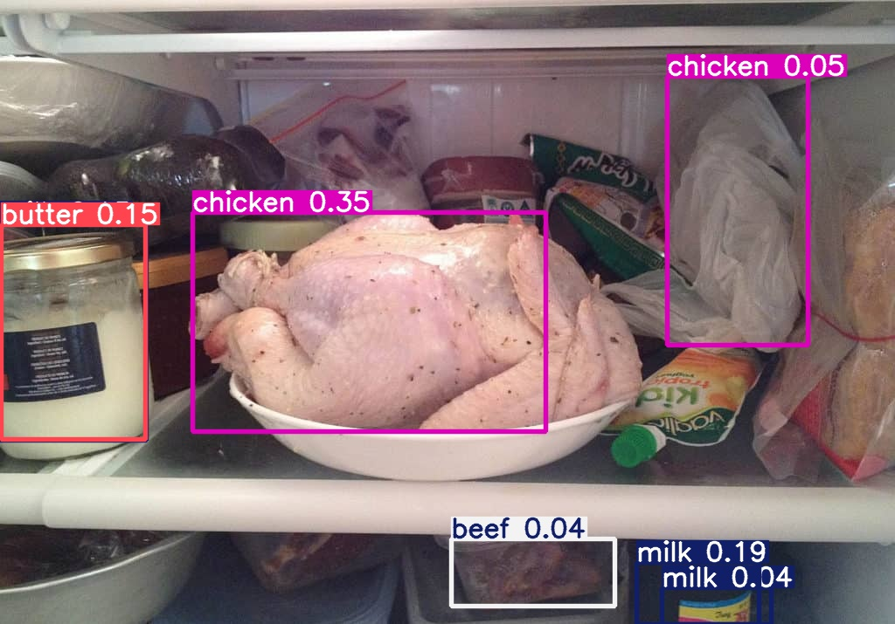
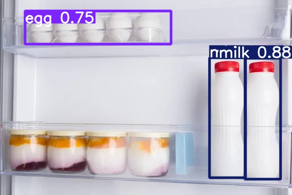
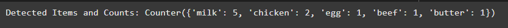
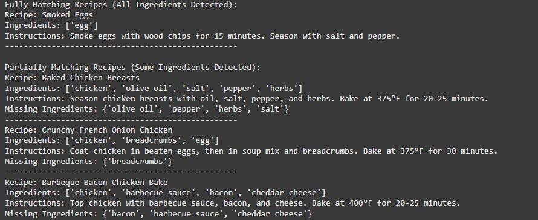

# SmartFridge: Intelligent Recipe Recommendation System

## Overview
The SmartFridge project uses YOLOv5 and a custom dataset to detect items in a fridge and recommend recipes based on the detected ingredients. This system integrates object detection, recipe matching, and a user-friendly interface to enhance the cooking experience.

---

## Features
- **Food Item Detection:** High-accuracy detection of food items inside the fridge using YOLOv5 and a custom dataset.
- **Recipe Recommendation:** Suggests recipes based on available ingredients.
- **Dynamic Database Integration:** JSON-based recipe database for easy expansion.
- **Custom Training:** Training the YOLOv5 model on a custom dataset using Google Colab.
- **Roboflow Integration:** Efficient dataset annotation and management via the Roboflow API.

---

## Dataset and Model
The dataset and model are hosted on Roboflow. You can access them [here](https://universe.roboflow.com/capstoneproject-yly17/fridge_roboflow).

---

## Demo
Here are some examples of the SmartFridge system in action:

### Step 1: Object Detection in the Fridge
**Center Shelf Detection Result:**

**Door Shelf Detection Result:**

### Step 2: Recipe Matching and Ingredient Recognition
**Ingredient Detection Output:**

### Step 3: Recipe Suggestion Based on Detected Ingredients
**Recipe Suggestion Output:**

---

## How to Use
1. Clone the repository.
2. Follow the steps in the `model_training.py` script to train the YOLOv5 model.
3. Use the `recommendation.py` script to generate recipe suggestions based on detected ingredients.
4. Refer to the [Roboflow Documentation](https://roboflow.com) to access and manage the dataset.

---

## Conclusion and Future Work

The **SmartFridge** project demonstrates the potential of using YOLOv5 for food item detection and recipe recommendation, integrating computer vision with practical applications in meal planning. By leveraging a custom dataset and Roboflow for annotation, the system can detect and suggest recipes based on the available ingredients in a fridge, enhancing the cooking experience for users.

### Future Research:
- **Improved Annotation Method**: Future research may focus on refining the annotation process, such as using polygonal annotations, to improve accuracy and make it applicable in more diverse settings.
- **3D Image Recognition**: By incorporating 3D imaging technology, models could better recognize items under varying lighting conditions and from different viewpoints, leading to higher accuracy in object detection.
- **Expiration-based Recipe Recommendations**: A valuable addition would be the ability to recommend recipes using items that are close to expiration, helping to reduce food waste and enabling more personalized meal planning.
- **Voice Commands and Nutritional Analysis**: Incorporating voice commands or providing nutritional analysis of recipes would improve the user experience, offering convenience and health insights.
- **Integration with E-commerce**: Integrating the system with e-commerce platforms could facilitate the purchase of missing ingredients and provide functionality for recognizing items stored in other conditions, such as in pantries or freezers.

These improvements could expand the capabilities of the **SmartFridge** system, making it more useful for everyday cooking while promoting sustainability and a more personalized experience for users.

---

## License
This project is licensed under the GPL-3.0 License.
